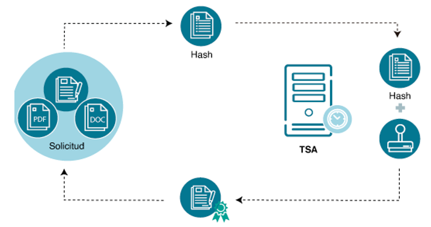

# Proyecto de Hashing y Sellado de Tiempo

## Contexto

Este proyecto tiene como objetivo implementar algoritmos de hashing y aplicar sellado de tiempo utilizando la API de FreeTSA. Se busca demostrar el conocimiento en criptografía, hashing y timestamping, todo ello en el marco de la asignatura de Redes de Computadoras (Universidad de Lima, 2024-2).

## Requerimientos

- **Python 3.x**
- **OpenSSL**: [Instrucciones de instalación](https://www.youtube.com/watch?v=coaGBdUcKiw&ab_channel=StraightToCoding).
- Librerías necesarias:
  - `hashlib`
  - `subprocess`
  - `os`
